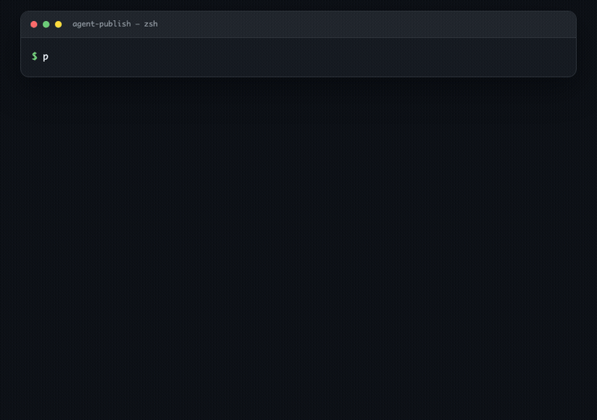
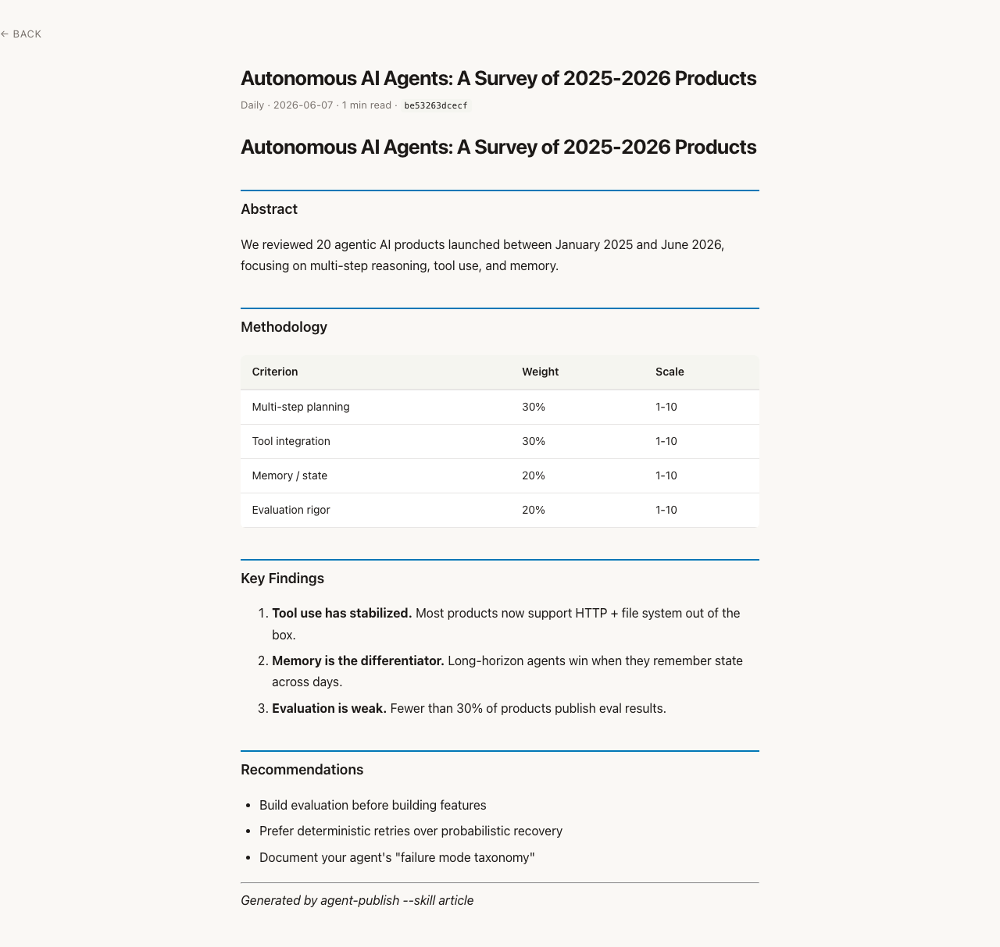
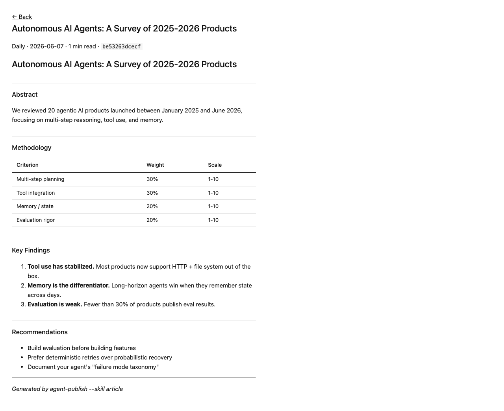
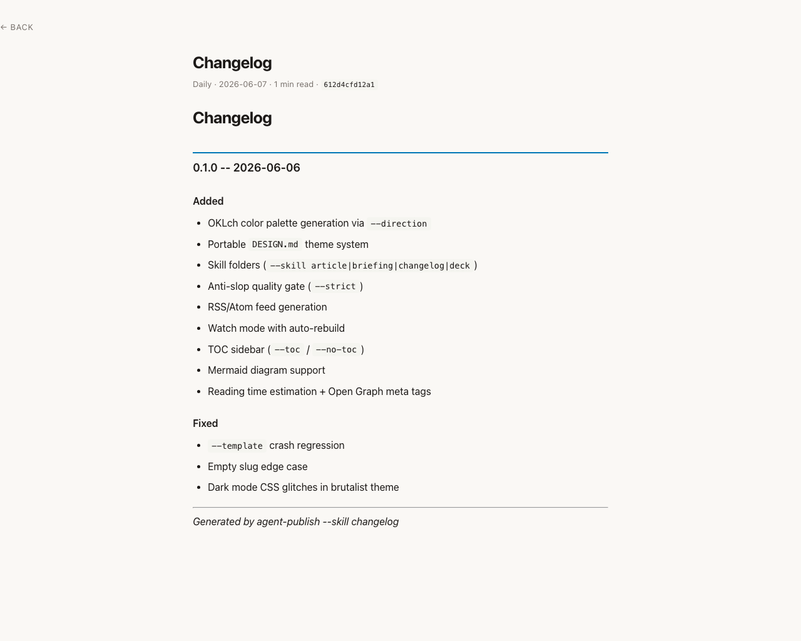

# agent-publish

[](https://pypi.org/project/agentpub/)
[](https://github.com/thisisprabha/agent-publish/actions/workflows/ci.yml)
[](https://opensource.org/licenses/MIT)

**Markdown-to-HTML pipeline for AI agents** — convert research outputs, logs, and agent artifacts into clean, styled HTML and publish to GitHub Pages. Zero manual intervention.

<p align="center">
  
</p>

## Why This Exists

The **"3 AM problem"**: You run overnight research, get markdown output... now what? agent-publish bridges that gap — turning raw agent outputs into publishable web pages with a single command.

## Quick Start

```bash
pip install agentpub

# Convert and publish in one command
agent-publish publish research.md --url https://user.github.io/repo

# Dry run to preview locally
agent-publish publish draft.md --dry-run --theme minimal
```

## Features at a Glance

### CLI-first publishing

| Command | What it does |
|---|---|
| `agent-publish publish <file.md>` | Convert markdown → HTML and push to GitHub Pages |
| `agent-publish index` | Regenerate `index.html` + RSS feed from existing output |
| `agent-publish watch` | Local dev server with auto-rebuild on file change |
| `agent-publish preview <file.md>` | Ephemeral preview with LiveReload |
| `agent-publish init` | Scaffold `agent-publish.toml` with commented defaults |

### Rendered output gallery

| Default theme | Minimal theme | More layouts |
|---|---|---|
|  |  |  |

<p align="center">
  
</p>

### Built-in themes

- **default** — Clean academic serif/sans hybrid, good for research notes
- **minimal** — Ultra-sparse, borderless, single container
- **brutalist** — Borders, monospace, high-contrast, no-frills
- **editorial** — Warm sienna/serif, publication-ready

All themes include dark mode, responsive breakpoints, print stylesheets, and WCAG AA accessibility.

### OKLch palette engine

Generate full CSS variable palettes from OKLch color space — zero dependencies:

| Direction | Vibe |
|---|---|
| `editorial` | Warm paper background, strong contrast |
| `modern-minimal` | Cool grays, crisp lines |
| `warm-soft` | Saturated warm primaries |
| `tech-utility` | Highly readable, blue-shifted |
| `brutalist` | Black/white/orange, intentionally raw |

### Skill templates

Auto-discoverable `skills/` folders with `SKILL.md` + `template.html` + `assets/`:

- **article** — Long-form narrative layout
- **briefing** — Compact, scannable
- **changelog** — Date-stamped list
- **deck** — Full-width presentation

### Quality gate

Built-in `AntiSlopChecker` catches marketing filler, broken heading hierarchy, empty sections, code blocks without language tags, and orphan links. Pass `--strict` to turn warnings into errors.

### More features

- Cache-aware dedup — prevents duplicate publishes via SHA-256 fingerprinting
- Auto-TOC sidebar with scroll-spy and collapsible sections
- Mermaid diagram rendering (auto-injected CDN)
- Multi-format export — EPUB, PDF (via WeasyPrint), plain Markdown
- Image optimization — JPEG compression, PNG quantize, PNG→WebP
- RSS/Atom feed generation
- Open Graph meta tags for social sharing
- Reading time estimation
- Smart typography — curly quotes, em-dashes, ellipsis
- Optional LLM features — auto-TL;DR, humanize, tag extraction
- Frontmatter schema validation via `.agent_publish_schema.yaml`
- Code block linting via `ruff`

## Install

```bash
pip install agentpub
```

From source:

```bash
git clone https://github.com/thisisprabha/agent-publish.git
cd agent-publish
pip install -e .
```

### Dependencies

**Runtime**: `markdown`, `pygments`, `toml`, `rich`, `pyyaml`, `watchdog`

**Optional**: `Pillow` (image optimization), `weasyprint` (PDF export)

## Config

An `agent-publish.toml` auto-discovered in the current directory (or `~/.config/agent-publish/`) lets you set defaults:

```toml
[output]
theme = "minimal"
base_url = "https://thisisprabha.github.io/warehouse"
site_title = "My Research"

[github]
auto_push = true
commit_prefix = "🤖 publish:"

[validation]
strict = false
```

Generate one interactively:

```bash
agent-publish init
```

## Architecture

```
src/agent_publish/
├── cli.py                # argparse entry points + rich console output
├── converter.py          # MD → HTML (tables, fenced code, TOC, mermaid)
├── themes.py             # Built-in CSS + custom CSS + DESIGN.md → CSS
├── publisher.py          # Git ops + fingerprint cache + index/feed
├── validator.py          # AntiSlopChecker + HTML verification
├── designmd.py           # DESIGN.md parser → CSS variable generation
├── oklch.py              # OKLch color space palette (zero deps)
├── skills_loader.py      # Auto-discovery of skill/ folders
├── exporters.py          # Plugin-based multi-format export
├── image_optimizer.py    # JPEG/PNG compression, PNG→WebP
├── feed.py               # RSS 2.0 XML builder
├── watch.py              # Watchdog-based local dev server
└── design_themes/        # Built-in DESIGN.md themes
    ├── default/
    ├── minimal/
    ├── editorial/
    └── brutalist/
```

## Tests

```bash
pytest tests/
```

80+ tests across 10 test files covering converter, validator, publisher cache, config, themes, OKLch, skills, humanize, TL;DR, tags, exporters, and image optimization.

## CLI Reference

### `publish` subcommand — all flags

| Flag | Description |
|---|---|
| `input.md ...` | Markdown file(s) to convert |
| `--url URL` | Base URL for published content |
| `--theme {default,minimal,brutalist,editorial}` | Built-in CSS theme |
| `--direction {editorial,modern-minimal,warm-soft,tech-utility,brutalist}` | OKLch palette |
| `--skill {article,briefing,changelog,deck}` | Load a skill folder template |
| `--theme-design PATH` | Portable DESIGN.md → CSS at build time |
| `--custom-css PATH` | Path to custom CSS file |
| `--template PATH` | Custom Jinja2/HTML template |
| `--toc` / `--no-toc` | Table of contents sidebar |
| `--strict` | Anti-slop warnings become errors |
| `--humanize` | LLM rewrite markdown before conversion |
| `--tldr` | Auto TL;DR summary injection |
| `--tags` | Auto-suggested topic tag badges |
| `--smart-typography` | Curly quotes, em-dashes, ellipsis |
| `--dry-run` | Convert without git push |
| `--repo REPO` | Target repository path |
| `--type {daily,weekly,note,research}` | Entry category |
| `--format {html,md,epub,pdf}` | Export format |
| `--optimize-images` | JPEG/PNG compression, PNG→WebP |
| `--eval` | HTTP verification after publish |
| `--lint-code` | Ruff check on Python code blocks |
| `--validate-frontmatter` | Schema validation |
| `--no-index` | Skip index.html regeneration |
| `--no-feed` | Skip feed.xml generation |
| `--no-mermaid` | Disable Mermaid diagram rendering |
| `--favicon PATH` | Favicon image |
| `--author NAME` | Author metadata |
| `--site-title TITLE` | Site title |
| `--og-image URL` | Open Graph image URL |
| `--config FILE` | Path to TOML/YAML config file |

### Other commands

| Command | Description |
|---|---|
| `agent-publish index` | Regenerate `index.html` + RSS feed |
| `agent-publish watch` | Watch `.md` files, serve on `localhost:8080`, auto-rebuild |
| `agent-publish preview <file.md>` | Ephemeral preview with LiveReload (`localhost:8765`) |
| `agent-publish init` | Scaffold `agent-publish.toml` |

## Python API

```python
from agent_publish import convert, publish, Config

# Convert markdown to styled HTML
result = convert(markdown_str, theme="editorial", skill="article")
# → result.html, result.title, result.reading_time

# Publish to GitHub Pages
pub_result = publish(html_path, title="My Post", config=config)
# → pub_result.success, pub_result.url, pub_result.commit_hash
```

## License

MIT
